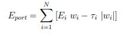

# R Source Code for Backtesting intraday strategies 

R is a free software environment for statistical computing and graphics. https://www.r-project.org

The function is **qrm.backtest()** with the following inputs: 

**(1)** days is the lookback; 

**(2)** d.r is used for computing risk, both as the length of the moving standard deviation tr (computed internally over d.r-day moving windows) as well as the lookback for computing the risk model (and, if applicable, a statistical industry classification) – see below;

**(3)** d.addv is used as the lookback for the average daily dollar volume addv, which is computed internally; 

**(4)** n.addv is the number of top tickers by addv used as the trading universe, which is recomputed every d.r days; 

**(5)** inv.lvl is the total investment level (long plus short, and the strategy is dollar-neutral); 

**(6)** bnds controls the position bounds (which are the same in this strategy as the trading bounds), i.e., the dollar holdings Hi for each stock are bounded via (Bi are the bnds elements,which can be uniform)

**|Hi| ≤ Bi Ai (548)**

where i = 1, . . . , N labels the stocks in the trading universe, and Ai are the corresponding elements of addv; 

**(7)** incl.cost is a Boolean for including linear trading costs, which are modeled as follows.248 For the stock labeled by i, let Ei be its expected return, and wi be its weight in the portfolio. The source code below determines wi via (mean-variance) optimization (with bounds). For the stock labeled by i, let the linear trading cost per dollar traded be τi. 

Including such costs in portfolio optimization amounts to replacing the expected return of the portfolio

 by 

A complete algorithm for including linear trading costs in mean-variance optimization is given in. However, for our purposes here the following simple “hack” suffices. 
We can define the effective return

  and simply set  

I.e., if the magnitude for the expected return for a given stock is less than the expected cost to be incurred, we set the expected return to zero, otherwise we
reduce said magnitude by said cost. This way we can avoid a nontrivial iterative procedure, albeit this is only an approximation. So, what should we use as τi in (551)? The model of is reasonable for our purposes here. Let Hi be the dollar amount traded for the stock labeled by i. Then for the linear trading costs we have

where σi is the historical volatility, Ai is the average daily dollar volume (ADDV), and ζ is an overall normalization constant we need to fix. However, above we work
with weights wi, not traded dollar amounts Hi. In our case of a purely intraday trading strategy discussed above, they are related simply via **Hi = I wi**, where **I**
is the total investment level (i.e., the total absolute dollar holdings of the portfolio after establishing it). Therefore, we have (note that **Ti = τi
|Hi| = τi I |wi|**)

We will fix the overall normalization ζ via the following heuristic. We will (conservatively) assume that the average linear trading cost per dollar traded is 10 bps (1 bps
= 1 basis point = 1/100 of 1%),249 i.e., mean(τi) = 10−3 and ζ = 10−3/mean(σi/Ai). Next, internally the code sources price and volume data by reading it from tabdelimited
files250 nrm.ret.txt (overnight return internally referred to as ret – see below), nrm.open.txt (daily raw, unadjusted open price, internally referred to as open), nrm.close.txt (daily raw, unadjusted close price, internally referred to as close), nrm.vol.txt (daily raw, unadjusted volume, internally referred to as vol), nrm.prc.txt (daily close price fully adjusted for all splits and dividends, internally referred to as prc). The rows of ret, open, close, vol and prc correspond to the N tickers (index i). Let trading days be labeled by t = 0, 1, 2, . . . , T, where t = 0 is the most recent day. Then the columns of open, close, vol and prc correspond to the trading days t = 1, 2, . . . , T, i.e., the value of t is the same as the value of the column index. On the other hand, the columns of ret correspond to the overnight close-toopen returns from the trading day t to the trading day t − 1. I.e., the first column of ret corresponds to the overnight close-to-open return from the trading day t = 1 to the trading day t = 0. Furthermore, ret, call it Ri(t), where t = 1, 2, . . . , T labels the columns of ret, is computed as follows:

Here: POi (t) is the raw open price (which is the corresponding element of open for t = 1, 2, . . . , T); PCi(t) is the raw close price (which is the corresponding ele-ment of close for t = 1, 2, . . . , T); PACi (t) is the fully adjusted close price (which is the corresponding element of prc for t = 1, 2, . . . , T); γadj i (t) is the adjust-ment factor, which is used for computing the fully adjusted open price PAO i(t); so Ri(t) is theovernight, close-to-open return based on fully adjusted prices. Note that the t = 0 prices required for computing Ri(1) are not part of the matrices open, close and prc. 

Also, the code internally assumes that the matrices ret, open, close, vol and prc are all aligned, i.e., all tickers and dates are the same and in the same order in each of the 5 files nrm.ret.txt (note the labeling of the returns described above), nrm.open.txt, nrm.close.txt, nrm.vol.txt and nrm.prc.txt. 

The ordering of the tickers in these files is immaterial, so long as it is the same in all 5 files as the code is oblivious to this ordering. However, the dates must be ordered in the descending order, i.e., the first column corresponds to the most recent date, the second column corresponds to the date before it, etc. (here “date” corresponds to a trading day). Finally, note that the internal function read.x() reads these files with the parameter value as.is = T. This means that these files are in the “R-ready” tab-delimited format, with N + 1 tab-delimited lines. The lines 2 through N + 1 have T + 1 elements each, the first element being a ticker symbol (so the N ticker symbols comprise dimnames(·)[[1]] of the cor-responding matrix, e.g., open for the open prices), and the other T elements being the T values (e.g., PO i(t), t = 1, . . . , T, for the open prices). 

However, the first line has only T elements, which are the labels of the trading days (so these comprise dimnames(·)[[2]] of the corresponding matrix, e.g., open for the open prices). Internal functions that use this input data, such as calc.mv.avg() (which computes simple moving averages) and calc.mv.sd() (which computes simple moving standard deviations) are simple and self-explanatory. 

As mentioned above, the input parameter d.r is used for recomputing the trading universe every d.r trading days and also recomputing the risk models (see below) every d.r trading days. These computations are done 100% out-of-sample, i.e., the trading day on which the resultant quantities are used for (simulated) trading. This is accomplished in part by using the internal function calc.ix(). Note that the input data described above is structured and further used in such a way that the backtests are 100% outof-sample. Here two conceptually different aspects must be distinguished. 

Thus, we have the expected returns and “the rest”, the latter – which can be loosely referred to as “risk management” – being the uni-verse se-lection, the risk model computation, etc., i.e., the machinery that gets us from the expected returns to the desired holdings (that is, the strategy posi-tions). The risk management part must be 100% out-of-sample. In real life the expected returns are also 100% outof-sample. However, in backtesting, while the ex-pected returns cannot under any circumstances look into the future, they can sometimes be “borderline in-sample”. Thus, consider a strategy that today trades on the overnight yesterday’s-close-totoday’s-open return. If we assume that the positions are established based on this return sometime after the open, then the backtest is out-of-sample by the “delay” time between the open and when the position is established. However, if we assume that the position is estab-lished at the open, then this is the so-called “delay-0” strategy, and the backtest is “borderline in-sample” in the sense that in real life the orders would have to be sent with some, albeit possibly small, delay, but could never be executed exactly at the open. In this sense it still makes sense to backtest such a strategy to measure the strength of the signal. What would make no sense and should never be done is to run an outright in-sample backtest that looks into the future. 

E.g., using today’s closing prices for computing expected returns for trading at today’s open would be grossly in-sample. On the other hand, using yesterday’s prices to trade at today’s open is the so-called “delay-1” strategy, which is basically 1 day out-of-sample (and, not surprisingly, is expected to backtest much worse than a delay-0 strategy). The code gives examples of both delay-0 (mean-reversion) and delay-1 (momentum) strategies (see the com-ments DELAY-0 and DELAY-1 in the code).

The code internally computes the desired holdings via optimization. The optimizer function (which incorporates bounds and linear constraints such as dollarneu-trality) bopt.calc.opt() is given in. One of its inputs is the inverse model covariance matrix for the stocks. This matrix is computed internally via functions such as qrm.cov.pc() and qrm.erank.pc(), which are given in and utilize the statistical risk model construction, or qrm.gen.het(), which is given in and utilizes the het-erotic risk model construction of. The latter requires a multilevel binary industry classification. The code below builds such a classifi-cation via the function qrm.stat.ind.class.all(), which is given in and utilizes the statistical industry classification construction of. However, the code can be straightforwardly modified to utilize a fundamental industry classification, such as GICS (Global Industry Classification Standard), BICS (Bloomberg Industry Classification System), SIC (Standard Industrial Classification), etc. 

One issue with this is that practically it is difficult to do this 100% out-of-sample. However, “in sampleness” of a fundamental industry classification – which is relatively stable – typically does not pose a serious issue in such backtests as stocks rarely jump industries. Furthermore, note that the aforesaid “external” functions have various other parameters (which are set to their implicit default values in the code below), which can be modified (see the references above that provide the aforesaid functions). Finally, the code internally computes the desired holdings and various performance characteristics such as the total P&L over the backtesting period, annualized return, annualized Sharpe ratio, and cents-per-share. These and other quantities computed internally can be returned (e.g., via environments or lists), dumped into files, printed on-screen, etc. The code is straightforward and can be tweaked depending on the user’s specific needs/strategies. Its purpose is illustrative/pedagogical.
